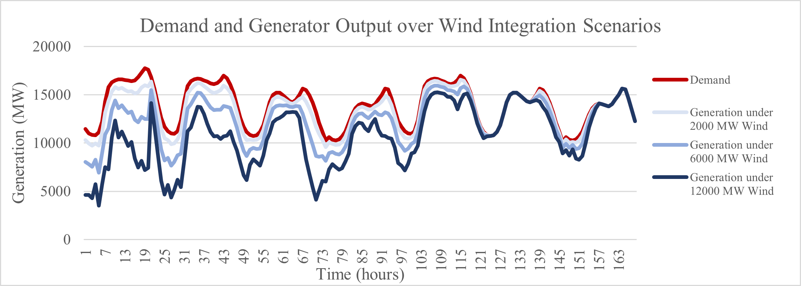
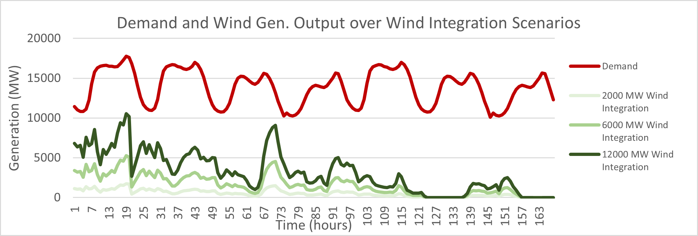

# Energy Systems Final Project
## EEEL 4220 Fall 2023 
## Project Prompt \#1: Wind Integration in ISO New England

### Objective
We took the position of a policy maker to provide policy suggestions to decarbonize ISO New England. We were provided with one week (168 hours) of data including wind generation capacity factors and demand. This report summarizing how to best integrate up to 12,000 MW of wind generation into the system and how the wind generation would impact the system operating cost. We compared how a carbon tax and wind incentive tax credits impacted the system perforance over operating cost, average price of electricity, wind curtailment, and revenue. 

### Code
final-project.ipynb: Initial formulation of the UC problem   
baseline-simulation-seven-days.ipynb: Full week simulation with no additions
carbon-tax-simulation-seven-days.ipynb: Full week simulation with carbon tax
wind-tax-simulation-seven-days.ipynb: Full week simulation with wind tax incentives
combination-simulation-seven-days.ipynb: Full week simulation with carbon tax and wind tax incentives

### Formulation 

Baseline Policy Scenario  
$Gen. Cost_d  = min⁡∑_t[∑_i(QC_i g_{i,t}^2+LC_i g_{i,t} +NLC_i u_{i,t}+SUC_i v_{i,t})+9000s_t]$ 

Carbon Tax Policy Scenario     
$Gen. Cost_d  = min⁡∑_t[∑_i(QC_i g_{i,t}^2+(LC_i + EF_i)g_{i,t} +NLC_i u_{i,t}+SUC_i v_{i,t})+9000s_t]$ 

Wind Tax Incentive Policy Scenario    
$Gen. Cost_d  = min⁡∑_t[∑_i(QC_i g_{i,t}^2+LC_ig_{i,t} +NLC_i u_{i,t}+SUC_i v_{i,t})+9000s_t - 26w_t]$   

Combination Policy Scenario    
$Gen. Cost_d  = min⁡∑_t[∑_i(QC_i g_{i,t}^2+(LC_i + EF_i)g_{i,t} +NLC_i u_{i,t}+SUC_i v_{i,t})+9000s_t - 26w_y]$   

Generator Revenue    
$Revenue = ∑_{t=1}^{168}(λ_t D_t)$    

Total Profit  
$Profit = ∑_{t=1}^{168}(λ_t D_t)- ∑_{d=1}^7Gen.Cost_d$

###	Results    
####	Generation and Demand Profile over a Week
 
 
Figures 1-2: Demand, Generation, and Wind Profile over a week.
Given the wind curtailment ratio is 0 over all scenarios, variation only occurs over wind capacity.

3.3	Total Profit over Wind Integration Scenarios
 
Figure 4

4.0	Discussion  
Overall, it is only by increasing the capacity of wind integration could the generation output of the thermoelectric powerplants be reduced (as seen in Fig 1-2). This is because the wind power came either as free or reduced the total cost operating costs in the wind tax incentive scenarios.  

4.1	Effectiveness of Carbon Tax Policy 
The implementation of the carbon tax policy had three noticeable effects. First, we observe that the total generation cost was the highest of all possible scenarios. This is due to adding the emission factor cost to the linear generation term. Second, the resulting average price of electricity is in general the highest across all wind integration scenarios as well. 

One final counter intuitive phenomenon to observe is that the profit increased alongside the generation costs. This is a result of the way we defined the profit in eq. (2.6) as a function of consumer cost in eq. (2.5). Both the thermoelectric generators and the wind operators profit from the increased price of electricity driven by the carbon tax. This directly increases the profits of both the generators and the wind operators satisfying the demand contract.

4.2	Effectiveness of Wind Tax Incentive Policy
In parallel to the carbon tax scenarios, we observe the same three effects. By creating a tax incentive policy for wind integration, the total operating costs were reduced across all scenarios. As a result, the average price of electricity is driven down. However, the generator revenue is on average the lowest across all scenarios since electricity is being sold at the lowest price.  
5.0	Recommendations
The first policy recommendation is to maximize wind integration capacity. This is demonstrated to be the only way to incentive the system to reduce thermoelectric generation.

The second policy recommendation is to adopt the wind incentive tax policy because it decreases the price of electricity for consumers and operating cost for generators.  

The carbon tax does not come as a recommended policy. So far, the carbon tax has only been shown to increase the price of electricity for consumers but did not motivate the system to decrease its thermoelectric output. Even though the combination policy seems to maximize global welfare, the tax places the increased cost burden on the consumers. The profit goes directly into the pocket of the generators without incentivizing them to change their behavior. 

