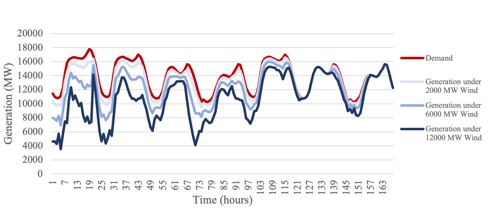
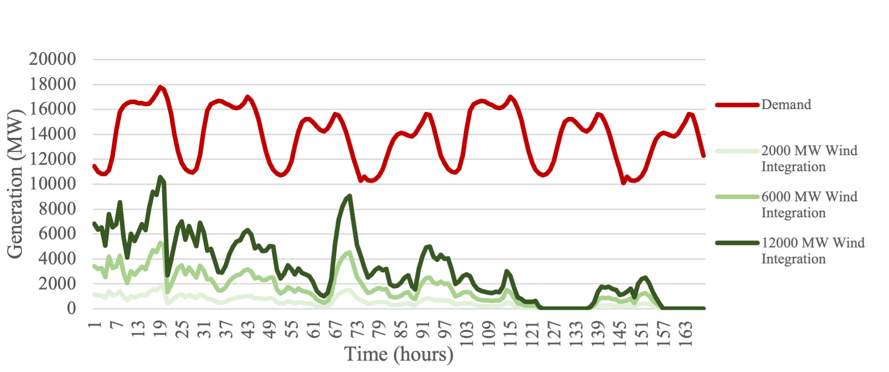
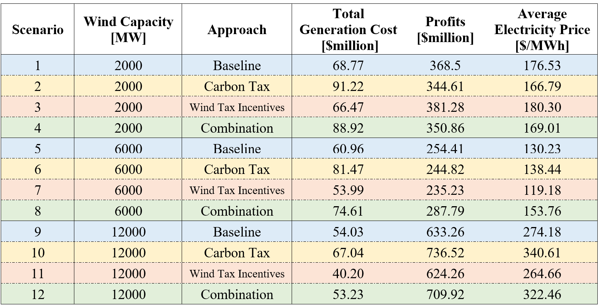
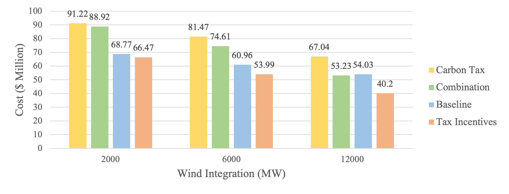
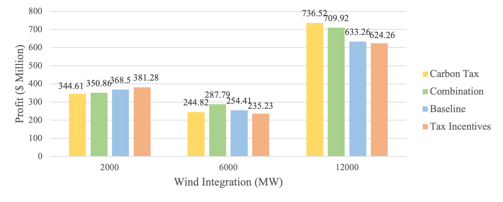

# Energy Systems Final Project
## EEEL 4220 Fall 2023 
## Project Prompt \#1: Wind Integration in ISO New England

### Code
- *final-project.ipynb*: Initial formulation of the UC problem  

- *baseline-simulation-seven-days.ipynb*: Full week simulation with no additions

- *carbon-tax-simulation-seven-days.ipynb*: Full week simulation with carbon tax

- *wind-tax-simulation-seven-days.ipynb*: Full week simulation with wind tax incentives

- *combination-simulation-seven-days.ipynb*: Full week simulation with carbon tax and wind tax incentives

## 1.0 Background
The decarbonization of ISO New England is critical to the climate goals of the states in the region. Accordingly, this report explores policies which could accelerate the integration of clean energy, particularly wind generation, into the power grid. 

A simplified model of ISO New England$^1$ is used to evaluate wind integration, electricity prices, and generator profits across various policy scenarios. This testbed for ISO New England generation is partitioned into nuclear, coal, petroleum, and natural gas generation. Three levels of wind capacity are evaluated¬–2,000 megawatts (MW), 6,000 MW, and 12,000 MW–to characterize the effectiveness of the potential policies at varying stages of wind integration. Analysis centers on two policy options: a carbon tax and a wind production tax incentive. A baseline scenario is also included to facilitate comparison, along with a fourth scenario that combines the carbon tax and wind tax incentive policies.

A carbon tax policy sets a price on carbon dioxide equivalent emissions; this price is then scaled for nuclear, coal, petroleum, and natural gas generation sources based on the respective emission factors. No emission factor is applied for clean wind generation–note that calculations also assume clean nuclear generation. This analysis assumes a base price of $\$25$ per metric ton of carbon dioxide equivalent emissions, a value that was deemed both politically feasible and physically meaningful based on its inclusion in a Congressional Budget Office working paper.$^2$ Generation types are identified using fuel codes and emission factors are estimated using data from the United States Energy Information Administration.$^{3,4,5}$ It was determined that coal emitted $2.30 lbs./kWh$, petroleum emitted $2.38 lbs./kWh$, and natural gas emitted $0.97 lbs./kWh$. These constants define $E_{Fuel Type}$ for each fuel type in the carbon tax equation in Section 2.2. 

An alternative policy is to implement wind tax incentives. Under the Inflation Reduction Act, wind projects over 1 MW are eligible for a full production tax credit amount of 2.6 cents per kilowatt-hour (kWh).5 All wind integration scenarios (2,000MW; 6,000 MW; 12,000 MW) are well over 1MW, thus this analysis assumes that all generators will be individually large enough to qualify for this threshold. It is also assumed that generators satisfy all other specifications, for example apprenticeship and prevailing wage requirements, in order to be eligible for the full production tax credit of 2.6 cents per kWh. Note that the legislation allows for either a production tax credit or an investment tax credit of 30%–since this analysis examines policy impacts on generation costs, not investment costs, it is premised on the assumption that generators will take advantage of the production as opposed to the investment tax credit. 

Since the Inflation Reduction Act is already enacted law, the wind tax incentive scenario can be assessed as an idealized implementation of the production tax incentives. In contrast, the baseline and carbon tax scenarios characterize the ISO New England system assuming that generators do not take advantage of the wind production tax credit–in other words, if they are not eligible or opt for the investment tax credit. Finally, the combined scenario simulating wind integration under both carbon tax and wind tax incentive policies models the impact of the additional carbon tax policy on top of the idealized implementation of existing wind production tax incentive policy.

### 2.0 Formulation 

All simulations minimize daily operating costs over a week of wind integration based on the following constraints: generation limits; wind generation capacity; ramp-up and ramp-down limits; start-up and start-down limits; and system reserve capacity. Distinctions among the scenarios are specified via the function minimizing daily operating costs–the objective function–as presented below. Further detail is included in the GitHub repository listed on the cover page of this report, which contains a separate simulation notebook for each policy scenario with critical distinguishing information identified.

#### 2.1 Baseline Policy Scenario Equations
The baseline objective function incorporates only the universally applicable costs including: the quadratic $QC$ and linear $LC$ generation costs, no-load costs $NLC$, and start-up costs $SUC$ associated with each generator; as well as the total load shedding costs $s_t$ for the system.

$$ Generation Cost_{day} = min \sum\limits_{t} \sum\limits_{i} (QC_ig_{i,t}^2 +LC_ig_{i,t} + NLC_iu_{i,t} +SUC_iv_{i,t}) + (9000)s_t $$

#### 2.2 Carbon Tax Policy Scenario Equations
The carbon tax scenario requires the following modification, shown in yellow, to the baseline objective function. The $EF$ term accounts for the price of carbon emissions as determined by the emission factor of the respective generation source, as outlined in the Background section of this report. 

$$ Generation Cost_{day} = min \sum\limits_{t} \sum\limits_{i} (QC_ig_{i,t}^2 +(LC_i+EF_i)g_{i,t} + NLC_iu_{i,t} +SUC_iv_{i,t}) + (9000)s_t $$

Tax scaled by emission factor (EF):

$$  E_{fuel type} = EF[\frac{pounds}{kWh}] * 1000[\frac{kWh}{MWh}] * \frac{1}{2205}[\frac{Mton}{pounds}] * 25[\frac{\$}{Mton}] = \frac{\$}{MWh}, over 1 hr generation = \frac{\$}{MW}$$

#### 2.3 Wind Tax Incentive Policy Scenario Equation
The wind tax incentive scenario requires the following modification, shown in orange, to the baseline objective function. The $26w_t$ term accounts for the tax credit for wind production, which is 26 cents per kWh or $\$$26/MW. Further detail on this calculation is provided in the relevant simulation notebook.

$$Generation Cost_{day} = min \sum\limits_{t} \sum\limits_{i} (QC_ig_{i,t}^2 +LC_ig_{i,t} + NLC_iu_{i,t} +SUC_iv_{i,t}) + (9000)s_t - (26)w_t$$

#### 2.4 Combination Policy Scenario Equation
The combination policy scenario models both the carbon tax and wind tax incentive modifications.

$$ Generation Cost_{day} = min \sum\limits_{t} \sum\limits_{i} (QC_ig_{i,t}^2 +(LC_i+EF_i)g_{i,t} + NLC_iu_{i,t} +SUC_iv_{i,t}) + (9000)s_t - (26)w_t$$

#### 2.5 Generator Revenue Equation
The consumer cost is given as the hourly price of electricity times demand summed over time. It is assumed that the revenue of the combined thermoelectric and wind generators is equal to the consumer cost–this rests on the premise that they are sole participants in satisfying the demand contract with no third parties. 

$$Revenue = \sum\limits_{t=1}^{168}(\lambda_t D_t)$$    

#### 2.6 Total Profit  
Total profit of the generators is defined as the difference between combined revenue and generating cost.

$$Profit = \sum\limits_{t=1}^{168}(\lambda_t D_t)- \sum\limits_{d=1}^7 Gen. Cost_d$$

### 3.0 Results    

Figures 1 and 2 present the traditional generation output–comprised of nuclear, coal, petroleum, and natural gas sources–and wind generation output under each set of wind integration scenarios. Given the wind curtailment ratio is 0 over all policy approaches, variation only occurs over wind capacity.

 
*Figure 1 Demand and generation under various wind integration scenarios over a week.*

 
*Figure 2 Demand and wind profile under various wind integration scenarios over a week.* 

Table 1 summarizes key economic metrics for each scenario varying wind capacity and policy approach.

*Table 1 Generation Cost, Profits, and Average Electricity Price under Various Wind Integration and Policy Scenarios*
 

Figure 3 groups wind integration scenarios to demonstrate generation cost variation across wind capacities and policy approaches.

 
*Figure 3 Total generation cost under various wind integration and policy scenarios.*

Figure 4 groups wind integration scenarios to demonstrate profit variation across wind capacities and policy approaches.

 
*Figure 4 Total profit under various wind integration and policy scenarios.*

### 4.0 Discussion
Overall, it is only by increasing the capacity of wind integration that the generation output of the thermoelectric power plants could be reduced, as seen in Figures 1-2. This is because the wind power was either free or reduced the total cost operating costs in the wind tax incentive scenarios.  

#### 4.1 Effectiveness of Carbon Tax Policy
The implementation of the carbon tax policy has three noticeable effects. First, the total generation cost is the highest of all possible scenarios. This is due to adding the emission factor cost to the linear generation term. Second, the resulting average price of electricity is in general the highest across all wind integration scenarios as well, signaling that the tax is passed on to consumers.

One final counterintuitive phenomenon to observe is that the profit increased alongside the generation costs. This is a result of the way the profit is defined in eq. (2.6) as a function of consumer cost in eq. (2.5). Both the thermoelectric generators and the wind operators profit from the increased price of electricity driven by the carbon tax. This directly increases the profits of both the generators and the wind operators satisfying the demand contract.

#### 4.2 Effectiveness of Wind Tax Incentive Policy
In parallel to the carbon tax scenarios, the same three effects are visible under the wind tax incentive scenarios. By creating a tax incentive policy for wind integration, the total operating costs are reduced across all scenarios. As a result, the average price of electricity is driven down. However, the generator revenue is on average the lowest across all scenarios since electricity is sold at the lowest price.  

### 5.0 Recommendations
The first policy recommendation is to maximize wind integration capacity. This is demonstrated to be the only way to incentive the system to reduce thermoelectric generation.

The second policy recommendation is to adopt the wind incentive tax policy because it decreases the price of electricity for consumers and operating cost for generators.  

The carbon tax does not come as a recommended policy. So far, the carbon tax has only been shown to increase the price of electricity for consumers but did not motivate the system to decrease its thermoelectric output. Even though the combination policy seems to maximize global welfare, the tax places an increased cost burden on the consumers. The profit goes directly into the pocket of the generators without incentivizing them to change their behavior. 

# Appendices

## Appendix A: Project Presentation
*See submitted report for Project Presentation slides*

## Appendix B: Additional Excel Plots
 
*Figure B-1: Average electricity price grouped by wind integration over all policy scenarios.*

 
*Figure B-2: Hourly marginal price over all wind integration and policy scenarios.*

Figure B-2 allows for the observation of outliers in this dataset. Abnormal price spikes reaching thousands of dollars per MWh skew the overall price of electricity for each scenario significantly higher.  